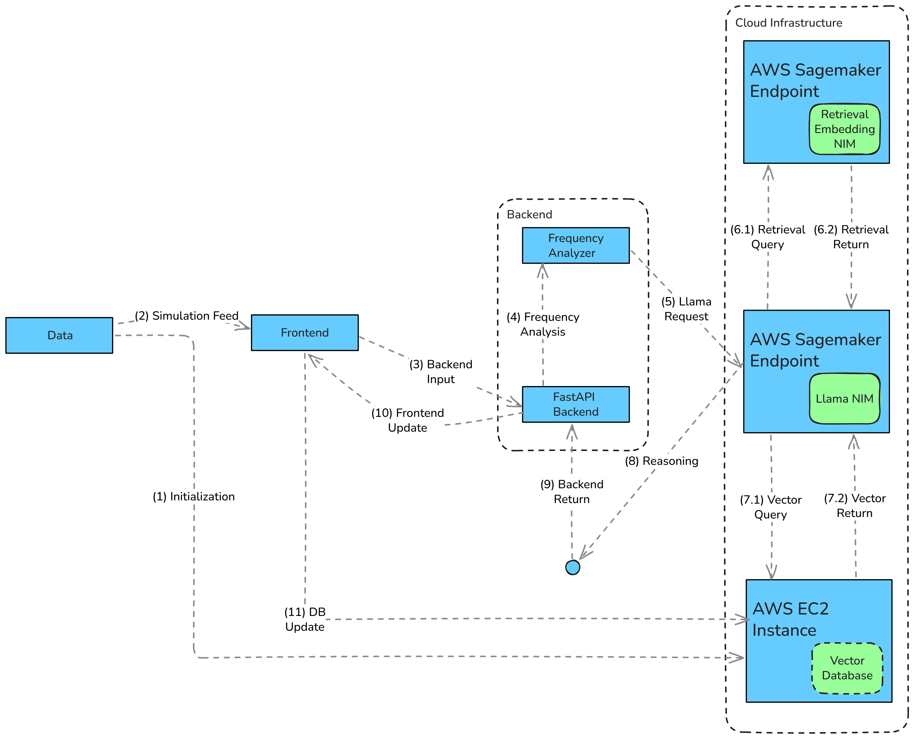

# 🌩️ PanTree

An AI-powered retail recommendation system that personalizes shopping through automated analysis and reasoning.

---

## ⚙️ Tech Stack

**Backend:** FastAPI, Python  
**AI:** Llama NIM, Retrieval Embedding NIM, Frequency Analysis Module  
**Database:** ChromaDB  
**Cloud:** AWS EC2, AWS SageMaker, Docker

---

## 🚀 Features

- 🧠 Personalized recommendations via AI coordination
- 📈 Frequency-based “Subscribe & Save” analysis
- 🔍 Semantic similarity search using embeddings
- ☁️ Scalable deployment on AWS SageMaker

---

## 🧩 Architecture

**(1) Initialization :** The user’s purchase history data is divided into two parts: **seed data** and **simulation data**. The seed data initializes the **vector database (Vector DB)** with a baseline customer profile.

**(2) Simulation Feed :** The **simulation data** is streamed month by month into the **frontend**, representing ongoing purchase activity in real time.

**(3) Backend Input :** Each month’s simulation data is sent from the **frontend** to the **FastAPI backend** for processing.

**(4) Frequency Analysis :** The **frequency analyzer** identifies which products were purchased frequently enough during the current month to qualify for potential Subscribe & Save recommendations.

**(5) Llama Request :** The **frequency analyzer** sends the list of high-frequency products to the **Llama NIM** hosted on a **SageMaker endpoint** for further reasoning.

**(6.1) Retrieval Query :** The **Llama NIM** queries the **Retrieval Embedding NIM** to find products that are similar or related to each item the user has purchased.

**(6.2) Retrieval Return :** The **Retrieval Embedding NIM** returns all related or semantically similar products for each of the user’s purchases back to the **Llama NIM**.

**(7.1) Vector Query :** The **Llama NIM** then queries the **Vector DB** to determine whether any of the related products returned by the **Retrieval NIM** already exist in the user’s historical purchase data.

**(7.2) Vector Return :** The **Vector DB** returns all matches and related products from the user’s past purchase history to the **Llama NIM**.

**(8) Reasoning :** The **Llama NIM** reasons which items should be added to Subscribe & Save based on two criteria:
  **(a)** products purchased at a high frequency this month, and
  
  **(b)** similar items the user has purchased in the past, as returned by the Vector DB.

**(9) Backend Return :** The results of the **Llama NIM’s reasoning**—the final recommendations—are sent back to the **FastAPI backend**.

**(10) Frontend Update :** The **SageMaker endpoint** returns these Subscribe & Save recommendations to the **frontend** for real-time display.

**(11) DB Update :** The **SageMaker endpoint** also sends this month’s **simulation data** to the **Vector DB**, updating it so that the system’s understanding of the user’s purchasing habits evolves continuously.

---

**Note A.** The **Vector DB** stores and updates semantic embeddings for each user, allowing long-term personalization by tracking evolving purchase patterns.

**Note B.** The **Frequency Analyzer** determines high-frequency purchases using thresholds (e.g., purchase count per month) before passing them to the reasoning model for context-based recommendation.

**Note C.** The **Retrieval NIM** provides semantic expansion (finding related products), while the **Llama NIM** performs reasoning and decision-making. Together, they form a retrieval-augmented recommendation loop that continuously improves with each simulation cycle.
